# Ex-03EDA

# AIM :
To perform EDA on the given data set. 

# EXPLANATION :
The primary aim with exploratory analysis is to examine the data for distribution, outliers and 
anomalies to direct specific testing of your hypothesis.
 

# ALGORITHM :
### STEP 1:
Create a new folder in jupyter notebook.
### STEP 2:
Upload the given csv file and open a python kernel.
### STEP 3:
Write the codes to execute data analysis in the python kernel .
### STEP 4: 
Plot the result in different methods for different Values.
### STEP 5:
End of the program.

# CODE :
```
import pandas as pd
import numpy as np
df=pd.read_csv("titanic_dataset.csv")
print(df)
df.info()
df.isnull()
df.isnull().sum()
df['Cabin']=df['Cabin'].fillna(df['Cabin'].mode()[0])
df['Age']=df['Age'].fillna(df['Age'].mode()[0])
df.head()
df.info()
df.isnull().sum()
df['Embarked']=df['Embarked'].fillna(df['Embarked'].mode()[0])
df.info()
df.isnull().sum()
import seaborn as sns
sns.countplot('Survived',data=df)
sns.countplot('Sex',data=df)
sns.countplot('Pclass',data=df)
sns.displot(df['Fare'])
sns.countplot(x='Pclass',hue='Survived',data=df)
sns.displot(df[df["Survived"]==0]['Age'])
pd.crosstab(df["Pclass"],df["Survived"])
pd.crosstab(df["Sex"],df["Survived"])
df.corr()
sns.heatmap(df.corr(),annot=True)
```
# OUTPUT : 
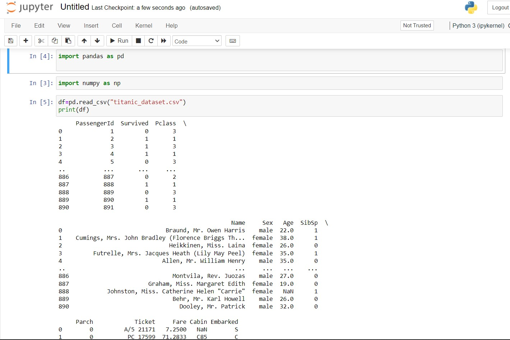
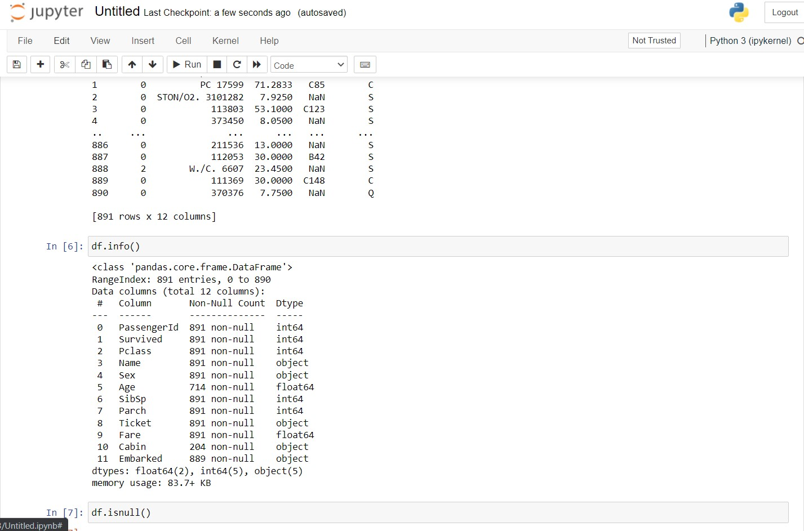
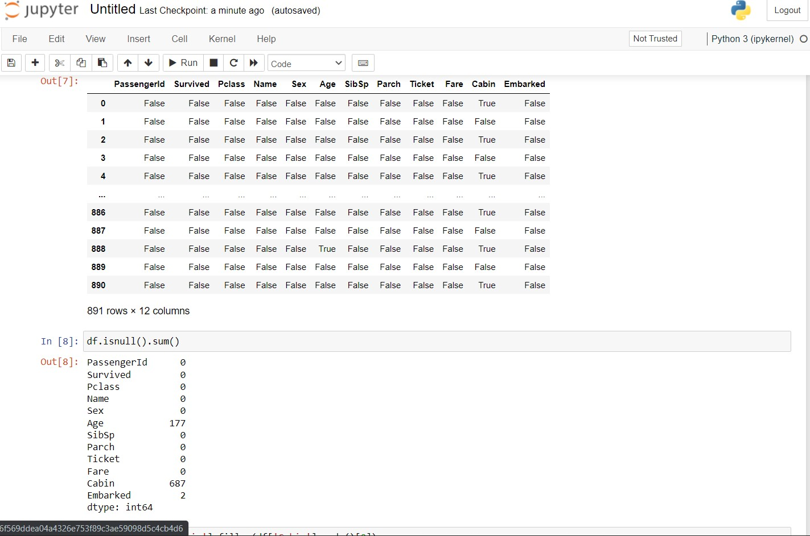
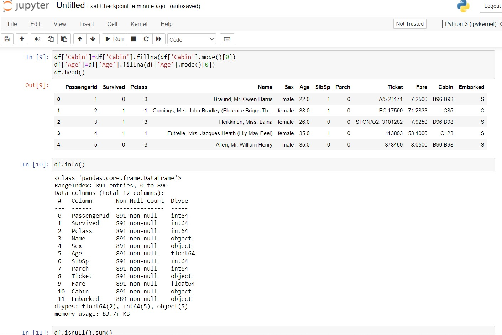
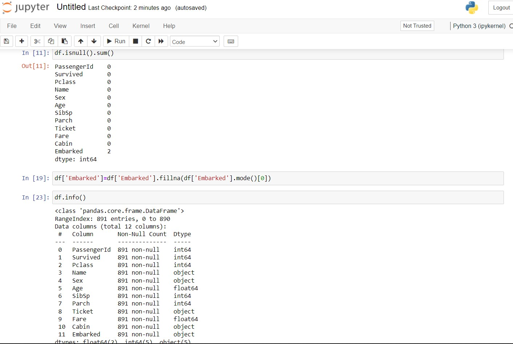
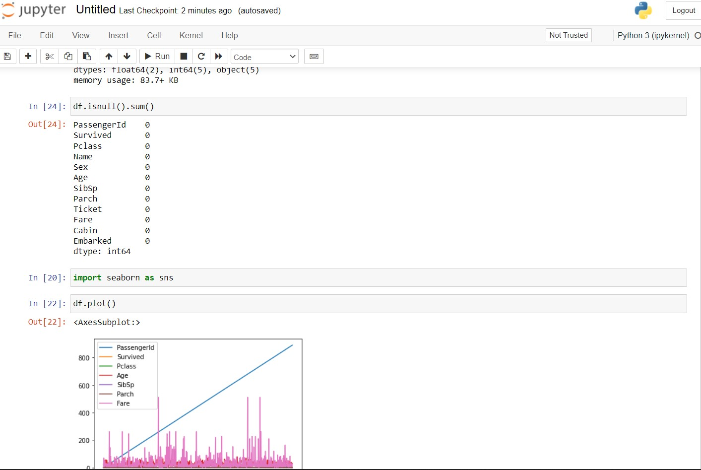
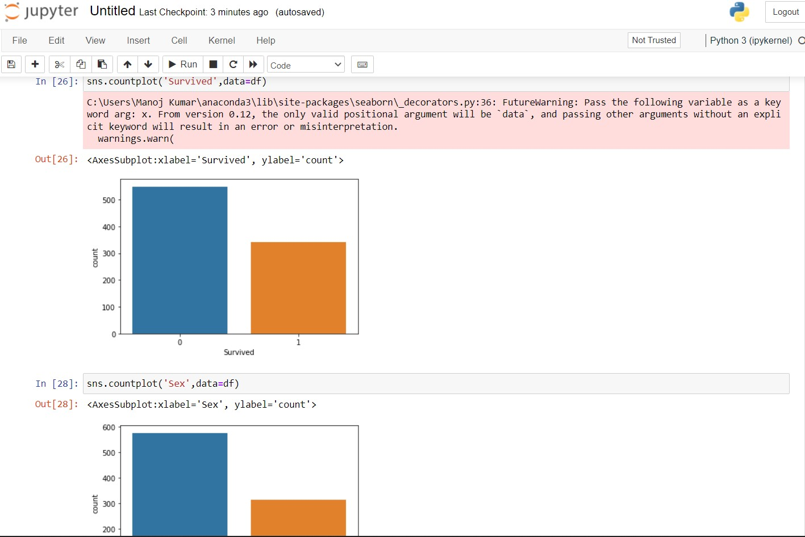
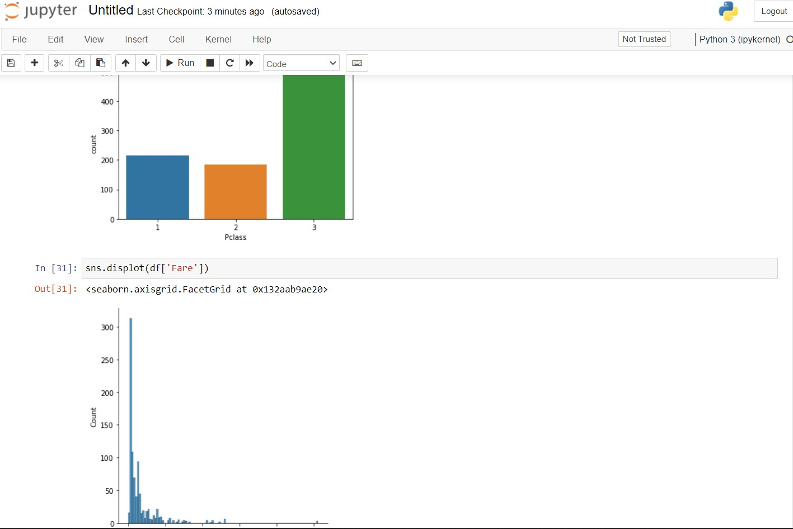
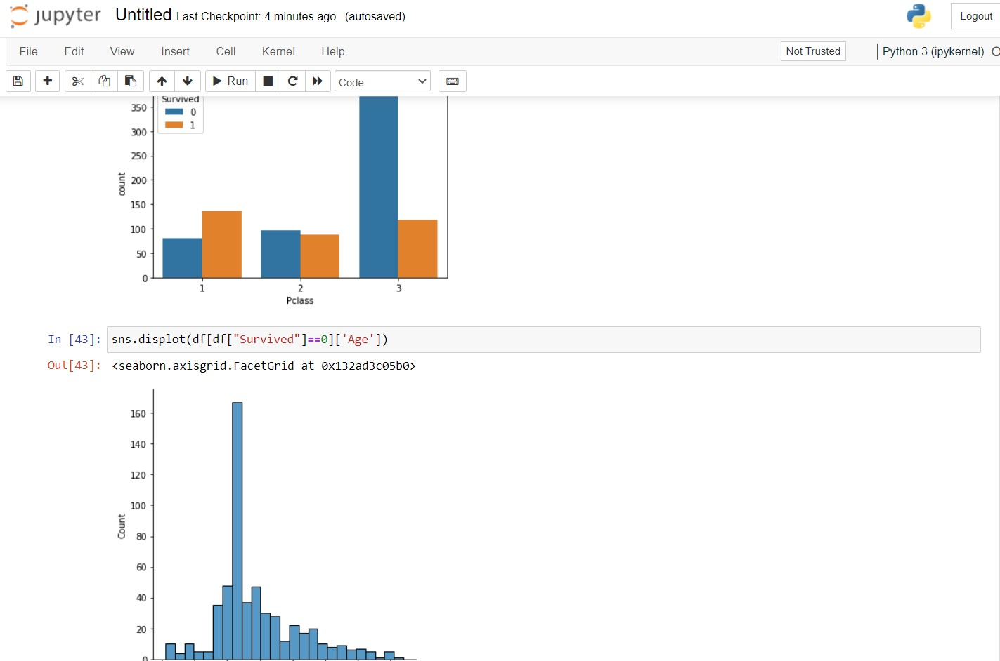
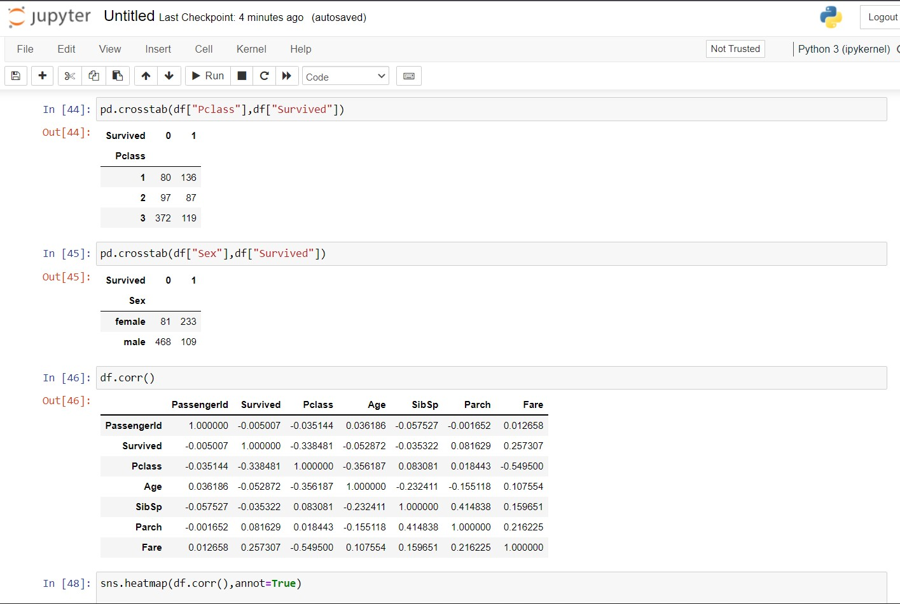
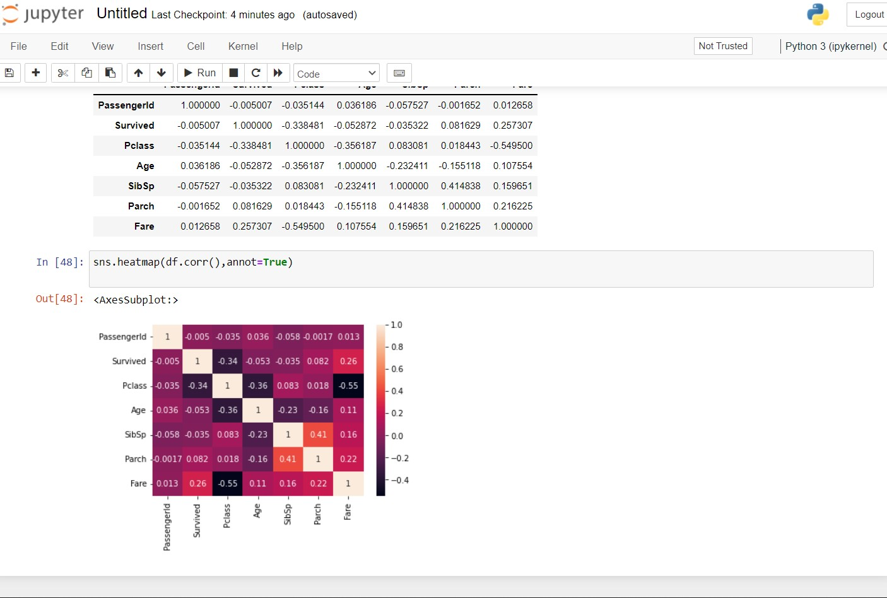

# RESULT :
Thus the given dataset is analysed using EDA method.